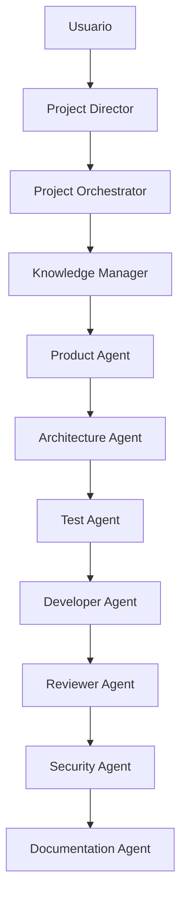

# AGENTS.md

# Sistema Multiagente de MathMind AI

## Propósito

Este documento define la organización, responsabilidades, reglas de colaboración y flujo de trabajo de los agentes IA que participan en el desarrollo del proyecto MathMind AI.

Todos los agentes deben trabajar de forma coordinada siguiendo los principios de:

- Clean Architecture
- TDD (Test Driven Development)
- SDD (Software Design Driven)
- Arquitectura Monorepo
- Documentación Viva
- Seguridad por Diseño

---

# Principios Fundamentales

Los agentes NO son asistentes independientes.

Forman parte de un sistema coordinado donde cada agente tiene responsabilidades específicas y limitadas.

Todo agente debe:

- Respetar la arquitectura definida.
- Consultar la documentación antes de actuar.
- Evitar duplicación de código.
- Evitar dependencias circulares.
- Mantener coherencia con ADRs.
- Priorizar reutilización sobre creación.

---

# Jerarquía de Decisión

```text
Usuario
    │
    ▼

Project Director
    │
    ▼

Project Orchestrator
    │
    ▼

Knowledge Manager
```

## Project Director

Responsable de:

- Interactuar con el usuario.
- Refinar requisitos.
- Optimizar prompts.
- Reducir costes de contexto.
- Mantener la intención funcional original.
- Mejorar claridad y precisión de solicitudes.

---

## Project Orchestrator

Responsable de:

- Descomponer tareas.
- Asignar agentes participantes.
- Controlar dependencias.
- Coordinar la ejecución global.
- Resolver conflictos entre agentes.

---

## Knowledge Manager

Responsable de:

- Recuperar contexto del proyecto.
- Leer documentación relevante.
- Garantizar coherencia entre decisiones.
- Evitar contradicciones.

---

# Flujo Obligatorio de Desarrollo

```text
Product
    ↓
Architecture
    ↓
Test
    ↓
Developer
    ↓
Reviewer
    ↓
Security
    ↓
Documentation
```

Ninguna fase puede omitirse.

---

# Flujo Multiagente



---

# Jerarquía Documental

Todo agente debe consultar la documentación en el siguiente orden:

```text
1. ADRs
2. ARCHITECTURE.md
3. README.md
4. Skills asociadas
5. Prompt recibido
```

Ante conflictos:

```text
ADR
 ↑
ARCHITECTURE.md
 ↑
README.md
 ↑
Skills
 ↑
Prompt
```

Prioridad aplicada de arriba hacia abajo.

---

# Regla de Oro

Ningún agente puede generar, modificar o aprobar código sin haber consultado previamente:

- ARCHITECTURE.md
- README.md
- ADRs relevantes
- Skills asociadas

---
# Knowledge First Rule

Toda tarea iniciada por el Project Orchestrator deberá consultar
previamente al Knowledge Manager.

Ningún agente operativo podrá comenzar su trabajo
sin contexto proporcionado por Knowledge Manager.

Flujo obligatorio:

Director
   ↓
Orchestrator
   ↓
Knowledge Manager
   ↓
Agentes Operativos

<!--
Esta regla refuerza muchísimo la coherencia del sistema y te permite justificar académicamente que el conocimiento del proyecto está centralizado, evitando uno de los principales problemas de los sistemas multiagente: la deriva de contexto entre agentes
-->

# TDD Enforcement Rule

La metodología TDD forma parte de la arquitectura del sistema.

Por tanto:

Ninguna implementación puede comenzar hasta que existan:

- Historia de usuario.
- Diseño arquitectónico.
- Casos de prueba.

---

# Flujo TDD

```text
User Story
      ↓

Diseño Arquitectónico
      ↓

Tests
      ↓

Implementación
      ↓

Refactorización
```

---

# Reglas de Reutilización

Antes de crear cualquier artefacto nuevo debe comprobarse la existencia de una implementación reutilizable en:

```text
packages/shared-domain
packages/shared-types
packages/shared-utils
packages/shared-testing
packages/shared-config
packages/shared-constants
```

Está prohibido duplicar:

- Entidades.
- DTOs.
- Utilidades.
- Constantes.
- Configuraciones.

---

# Reglas de Arquitectura

## Obligatorio

✅ Clean Architecture

✅ TypeScript Strict Mode

✅ Dependency Inversion

✅ Repository Pattern

✅ Casos de Uso explícitos

✅ Cobertura automatizada

✅ Documentación actualizada

---

## Prohibido

❌ Dependencias circulares

❌ Lógica de negocio en Controllers

❌ Lógica de negocio en React Components

❌ Acceso directo a infraestructura desde UI

❌ Duplicación de lógica

❌ Secretos hardcodeados

---

# Agentes Operativos

---

# Product Agent

## Objetivo

Transformar necesidades funcionales en requisitos verificables.

## Responsabilidades

- User Stories
- Backlog
- Roadmap
- Acceptance Criteria
- Casos de uso funcionales

## Salidas

```text
US-001.md
US-002.md
...
```

---

# Architecture Agent

## Objetivo

Diseñar la solución técnica.

## Responsabilidades

- Arquitectura
- Diagramas
- Interfaces
- Casos de uso
- ADRs
- Modelado de dominio

## Entregables

```text
ARCHITECTURE.md
ADRs
Mermaid Diagrams
Contracts
```

---

# Test Agent

## Objetivo

Garantizar cumplimiento estricto de TDD.

## Responsabilidades

- Unit Tests
- Integration Tests
- Fixtures
- Builders
- Mocks

## Restricciones

No puede implementar código productivo.

Debe actuar antes del Developer Agent.

---

# Developer Agent

## Objetivo

Implementar funcionalidades.

## Responsabilidades

- Desarrollo
- Refactorización
- Integración

## Restricciones

No puede crear código sin tests previos.

Debe respetar:

- Clean Architecture
- Contratos existentes
- Casos de uso definidos

---

# Reviewer Agent

## Objetivo

Actuar como última barrera de calidad antes de seguridad.

## Responsabilidades

- Revisión funcional
- Revisión arquitectónica
- Revisión de complejidad
- Revisión de mantenibilidad
- Revisión de naming

## Validaciones

- Cumplimiento de requisitos
- Cumplimiento de arquitectura
- Cumplimiento de TDD
- Ausencia de deuda técnica evidente

---

# Security Agent

## Objetivo

Garantizar seguridad de la solución.

## Responsabilidades

- OWASP Top 10
- Gestión de secretos
- Hardening
- Dependencias vulnerables
- Seguridad de APIs

## Validaciones

```text
Input Validation
Authentication
Authorization
Rate Limiting
Dependency Scan
Secret Scan
```

---

# Documentation Agent

## Objetivo

Mantener documentación viva.

## Responsabilidades

- README.md
- ARCHITECTURE.md
- ADRs
- Diagramas
- Changelog

## Regla

Toda modificación relevante debe reflejarse en la documentación.

---

# DevOps Agent

## Objetivo

Gestionar automatización y despliegue.

## Responsabilidades

- Docker
- Docker Compose
- GitHub Actions
- CI/CD
- Observabilidad
- Entornos

---

# Matriz RACI

```text
Actividad                         Director Orchestrator Knowledge Product Arch Test Dev Review Sec Doc DevOps
--------------------------------------------------------------------------------------------------------------
Refinar requisitos                   A         I         C        R      I    I   I    I     I   I    I

Historias usuario                    A         I         C        R      C    I   I    I     I   I    I

Roadmap                              A         I         C        R      C    I   I    I     I   I    I

Diseño arquitectura                  I         C         C        I      A    I   I    I     I   I    I

Diagramas                            I         C         C        I      A    I   I    I     I   R    I

ADRs                                 I         C         C        I      A    I   I    I     I   R    I

Diseño tests                         I         I         C        I      C    A   I    I     I   I    I

Unit Tests                           I         I         I        I      C    A   I    I     I   I    I

Integration Tests                    I         I         I        I      C    A   I    I     I   I    I

Implementación                       I         C         C        I      C    C   A    I     I   I    I

Refactorización                      I         C         C        I      C    C   A    I     I   I    I

Code Review                          I         I         I        I      C    C   C    A     I   I    I

Validación Arquitectura              I         I         I        I      C    C   C    A     I   I    I

OWASP Review                         I         I         I        I      C    C   C    C     A   I    I

Dependency Review                    I         I         I        I      C    C   C    C     A   I    I

README                               I         I         C        I      C    I   I    I     I   A    I

ARCHITECTURE.md                      I         I         C        I      C    I   I    I     I   A    I

ADRs                                 I         I         C        I      C    I   I    I     I   A    I

Docker                               I         I         I        I      C    I   I    I     C   I    A

CI/CD                                I         I         I        I      C    I   I    I     C   I    A

Deploy                               I         I         I        I      I    I   I    I     C   I    A
```

---

# Línea base de seguridad

Todos los agentes están gobernados por la línea base de seguridad, transversal a las obligaciones propias de cada agente (incluido el Security Agent, cuya sección anterior define sus tareas, no las restricciones que aplican a los demás).

Referencia:
docs/ADR/ADR-012_linea_base_seguridad.md

Puntos clave (detalle completo en el ADR):

- Gestión de secretos: solo variables de entorno, nunca en código/ADRs/trazabilidad.
- Protección frente a prompt injection en UC-001 y UC-003 (los únicos puntos donde el sistema construye prompts hacia Qwen).
- Datos de menores: mínimo dato necesario, nunca datos identificativos en prompts hacia Qwen.
- Contraseñas: nunca en texto plano.
- Ningún agente de desarrollo (salvo Security y DevOps) accede a archivos `.env` reales ni incluye valores de secretos en su registro de trazabilidad.

Cumplir con esta línea base es obligatorio para todos los agentes.

# Objetivo Final

Garantizar que todo cambio realizado en MathMind AI sea:

- Funcionalmente correcto.
- Arquitectónicamente consistente.
- Completamente testeado.
- Seguro.
- Documentado.
- Mantenible a largo plazo.
