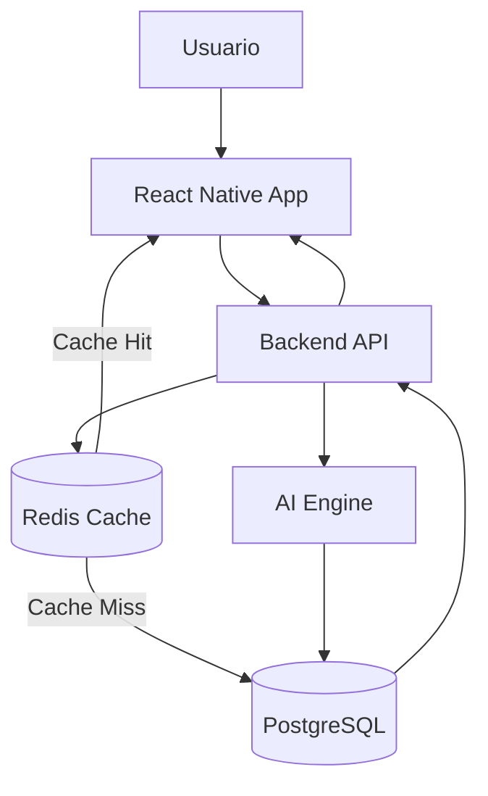

# MathMind AI

## Introducción

MathMind AI es una plataforma de aprendizaje adaptativo de cálculo mental orientada a estudiantes de diferentes niveles académicos.

La aplicación combina técnicas tradicionales de gamificación con Inteligencia Artificial para generar experiencias de entrenamiento personalizadas, ajustando la dificultad de los ejercicios según el rendimiento real de cada usuario.

El proyecto forma parte del Trabajo Fin de Máster en Desarrollo de Software Potenciado con IA. El objeto de estudio no es solo la aplicación en sí: MathMind AI se construye siguiendo un **sistema multiagente de IA especializado por rol** (Product, Architecture, Test, Developer, Reviewer, Security, Documentation, DevOps), gobernado por reglas explícitas (`.ai/AGENTS.md`) y documentado mediante Architecture Decision Records (`docs/ADR/`). El detalle completo de esa gobernanza — diseño, métricas reales de cumplimiento e incidentes documentados — está en `docs/TFM_PRESENTACION_GOBERNANZA.md`.

---

# Objetivo de la aplicación

El objetivo principal es mejorar la capacidad de cálculo mental de los usuarios mediante ejercicios matemáticos adaptativos generados y gestionados por un sistema inteligente.

La plataforma es capaz de:

- Evaluar continuamente el rendimiento del usuario.
- Ajustar automáticamente la dificultad de los ejercicios.
- Proporcionar retroalimentación inmediata.
- Ofrecer pistas contextuales cuando el usuario tenga dificultades.
- Mostrar explicaciones detalladas de la solución.
- Mantener la motivación mediante elementos de gamificación (puntuación, nivel y estadísticas de progreso).

---

# Público objetivo

La aplicación está diseñada para diferentes perfiles educativos:

- Educación Primaria
- Educación Secundaria
- Bachillerato
- Ingeniería y carreras técnicas

Cada nivel dispone de conjuntos de ejercicios y estrategias de aprendizaje específicas ([ADR-006](docs/ADR/ADR-006_math_topics.md)).

---

# Funcionalidades Principales

## Acceso y sesión

- **Registro / Login** con email y contraseña (bcrypt, JWT).
- **"Prueba sin registrarte"** — acceso de invitado con un solo clic, sin formulario (ver [Usuario y contraseña de prueba](#usuario-y-contraseña-de-prueba)).
- **Cierre de sesión** manual (botón) y automático tras 15 minutos de inactividad, con aviso previo y opción de continuar.

## Modo Test

El usuario debe seleccionar una respuesta entre tres opciones posibles.

Características:

- Tiempo límite configurable.
- Corrección automática.
- Explicación de la respuesta.
- Registro de estadísticas.

## Modo Resolución

El usuario introduce manualmente el resultado.

Características:

- Entrada libre de respuestas.
- Temporizador configurable.
- Generación de pistas progresivas.
- Resolución guiada.

## Motor de Adaptación

La dificultad no depende exclusivamente del modelo de IA.

Se calcula mediante un rating continuo tipo Elo ([ADR-005](docs/ADR/ADR-005-adaptive-difficulty-engine.md)), usando métricas objetivas:

- Precisión histórica.
- Velocidad media de respuesta.
- Racha actual.
- Dificultad anterior.

Esto permite una experiencia consistente y económicamente sostenible.

## Sistema de Pistas

Cuando el usuario no resuelve un ejercicio dentro del tiempo establecido:

- No se muestra directamente la solución.
- Se presenta una pista orientativa, generada por IA.
- Se intenta reforzar el razonamiento matemático.

## Progreso y estadísticas

- Puntuación (rating) por nivel académico explorado.
- Historial y estadísticas de progreso por Tema, con etiquetas "Fuerte" / "A mejorar".
- Resumen al finalizar cada sesión (aciertos, tiempo medio de respuesta, variación de rating).

## Base de conocimiento (RAG)

Un administrador del sistema puede depositar material de referencia (texto/Markdown) en un directorio local; se indexa con embeddings locales y enriquece — de forma opcional, sin bloquear el flujo normal — la generación de ejercicios y pistas ([ADR-014](docs/ADR/ADR-014_rag.md)). No es una funcionalidad visible para el estudiante.

---

# Estrategia de Inteligencia Artificial

Uno de los objetivos del proyecto es demostrar una utilización eficiente de modelos generativos en un entorno real.

Por este motivo:

- La IA no participa en cada petición del usuario.
- Los ejercicios se generan previamente mediante procesos batch.
- Los resultados se almacenan en PostgreSQL.
- La IA se utiliza principalmente para:
  - Generación masiva de ejercicios.
  - Generación de pistas progresivas.
  - Explicaciones paso a paso.
  - Creación de contenido bajo demanda cuando el pool de un Tema se agota de verdad (último recurso, no camino feliz).

Esta arquitectura reduce costes, mejora la latencia y aumenta la escalabilidad. El cliente de IA es **agnóstico de proveedor** — cualquier endpoint compatible con la API de OpenAI (Qwen/DashScope, DeepSeek, Hugging Face Inference Providers, etc.), configurable por variables de entorno.

---

# Stack Tecnológico

## Frontend

- React Native + Expo (Android, iOS y Web desde una única base de código)
- Expo Router
- TypeScript
- Zustand
- TanStack Query

## Backend

- Node.js + Express
- TypeScript
- Prisma (ORM)

## Motor IA

- LangChain
- TypeScript
- Zod (validación de la salida del LLM en tiempo de ejecución)
- Cliente agnóstico de proveedor (Qwen, DeepSeek, Hugging Face Inference Providers...)

## Persistencia

- PostgreSQL + **pgvector** (embeddings para RAG)
- Redis — declarado en el stack de desarrollo ([ADR-016](docs/ADR/ADR-016_entorno_docker.md)) como caché de baja latencia prevista para el Exercise Pool; a día de hoy sin consumidor de código (no bloquea ninguna funcionalidad).

## Calidad

- Vitest
- Playwright (E2E)
- ESLint
- Prettier

## DevOps / Infraestructura

- Docker + Docker Compose (entorno de desarrollo)
- GitHub Actions (CI/CD: `quality` → `e2e` → `deploy`)
- AWS (EC2 free tier + CloudFormation, IaC en `deploy/aws/`), autenticación OIDC sin claves de larga duración

---

# Arquitectura General

El proyecto sigue una arquitectura basada en monorepo (npm workspaces + Turborepo).

```text
mathMindIA
│
├── apps
│   ├── mobile-app       # React Native / Expo (Android, iOS, Web)
│   ├── backend-api      # Express + Prisma + Clean Architecture
│   └── ai-engine        # LangChain — generación batch de ejercicios
│
├── packages
│   ├── shared-domain    # Entidades, Value Objects, puertos, repositorios
│   ├── shared-types     # DTOs de la API
│   ├── shared-utils     # Validaciones/utilidades compartidas
│   ├── shared-testing   # Fakes/mocks/builders para tests
│   ├── shared-config    # Configuración compartida
│   └── shared-constants # Constantes compartidas
│
├── .ai                  # Gobernanza del sistema multiagente: reglas, skills, trazabilidad
├── docs                 # ADRs, User Stories, Casos de Uso, STATUS.md, documentación del TFM
├── database             # schema.prisma
├── deploy               # IaC de despliegue en AWS (CloudFormation)
├── docker                # Dockerfile del contenedor de desarrollo
├── .github/workflows     # CI/CD (GitHub Actions)
├── rag                   # Directorios de entrada/histórico de ingesta RAG
└── scripts               # Scripts de métricas y de configuración del entorno
```

# Flujo General de la Plataforma



> Diagrama de diseño objetivo del "Cache Strategy" ([ARCHITECTURE.md](ARCHITECTURE.md)). A día de hoy `backend-api` consulta PostgreSQL directamente — Redis está declarado en el stack pero sin consumidor de código todavía (ver Stack Tecnológico, Persistencia).

---

# Metodología de Desarrollo

El proyecto se desarrolla siguiendo:

## Clean Architecture

Separación estricta entre:

- Domain
- Application
- Infrastructure
- Presentation

## TDD

Todo desarrollo comienza mediante pruebas automatizadas.

Ciclo:

1. Red
2. Green
3. Refactor

## SDD

Las decisiones arquitectónicas preceden a la implementación.

Documentos clave:

- ADRs (`docs/ADR/`)
- Diagramas
- Casos de uso (`docs/use-cases/`)
- User Stories (`docs/user-stories/`)
- Contratos (`apps/backend-api/openapi.yaml`)

---

# Instalación y Ejecución

## Requisitos

- Node.js (versión fijada en `.nvmrc`)
- Docker Desktop (Postgres + Redis + contenedor de desarrollo del backend)
- Expo CLI (se instala como dependencia del proyecto, no hace falta instalarlo aparte)

## 1. Clonar e instalar dependencias

```bash
git clone <url-del-repositorio>
cd mathMindIA
npm install
```

## 2. Variables de entorno

Copia las plantillas y ajusta lo necesario (los valores por defecto ya funcionan para desarrollo local sin IA):

```bash
cp .env.example .env                                 # variables de Docker Compose
cp apps/backend-api/.env.example apps/backend-api/.env
cp apps/mobile-app/.env.example apps/mobile-app/.env
```

- `JWT_SECRET`: obligatorio para que el backend arranque (cualquier cadena en desarrollo).
- `AI_API_KEY` / `AI_BASE_URL` / `AI_MODEL_NAME`: opcionales — sin ellas, la generación de ejercicios/pistas por IA falla con un error claro, pero el resto de la aplicación (login, sesiones con ejercicios ya generados, estadísticas) funciona igual.

## 3. Levantar el entorno de desarrollo (Docker)

```bash
docker compose up -d --build
# o el script de conveniencia (PowerShell):
# powershell -ExecutionPolicy Bypass -File scripts/setup/dev-env.ps1
```

Esto levanta PostgreSQL (con `pgvector`), Redis y un contenedor Node con `backend-api` arrancado en modo watch (`tsx watch`) sobre el puerto `3000`.

Primera vez — sincronizar el esquema de base de datos:

```bash
docker compose exec node npm run db:generate
docker compose exec node npx prisma db push
```

Verificación rápida del backend:

```bash
curl http://localhost:3000/health
```

## 4. Arrancar `mobile-app`

```bash
cd apps/mobile-app
npm run web        # navegador (recomendado para evaluación rápida)
npm run android    # emulador/dispositivo Android
npm run ios        # simulador iOS
```

Por defecto `mobile-app` apunta a `http://localhost:3000` (`EXPO_PUBLIC_API_BASE_URL`).

## 5. Tests

```bash
npm run test        # unit/integration tests de todo el monorepo (Vitest)
npm run typecheck    # tsc --noEmit en todo el monorepo
npm run lint         # ESLint en todo el monorepo
```

Detalle completo del entorno Docker (servicios, migraciones, RAG, tests de integración): [ARCHITECTURE.md § Entorno de Desarrollo con Docker](ARCHITECTURE.md) y [ADR-016](docs/ADR/ADR-016_entorno_docker.md).

---

# Usuario y contraseña de prueba

La aplicación tiene login real (email + contraseña, bcrypt + JWT). Para evaluar el proyecto **no hace falta crear una cuenta manualmente**:

- **Recomendado — botón "Prueba sin registrarte"** en la pantalla de Login: crea una cuenta de invitado (`Publico<número>@invitado.mathmind.local`, nivel Secundaria) y entra de inmediato, sin ningún formulario ([US-009](docs/user-stories/US-009-acceso-invitado.md)). Pensado explícitamente para facilitar la corrección del TFM — cada clic crea una cuenta nueva, así que se puede usar tantas veces como haga falta.
- **Alternativa — registro propio**: pantalla "Registrarse", con cualquier email y una contraseña de 8 caracteres o más.

No existe ningún usuario ni contraseña fijos y publicados en este repositorio — cada cuenta (incluidas las de invitado) se crea con credenciales propias, nunca compartidas ni versionadas ([ADR-012](docs/ADR/ADR-012_linea_base_seguridad.md)).

---

# Estado del Proyecto

**MVP funcional completo**: 10 User Stories implementadas (US-001 a US-010), 14 ADR en estado Aceptado, backend real de punta a punta (persistencia PostgreSQL, autenticación, RAG), `mobile-app` desplegable a Android/iOS/Web, CI/CD real (GitHub Actions) con despliegue continuo a AWS.

Detalle completo, actualizado tarea a tarea, en [`docs/STATUS.md`](docs/STATUS.md). Gobernanza del sistema multiagente — diseño, métricas de cumplimiento real e incidentes documentados — en [`docs/TFM_PRESENTACION_GOBERNANZA.md`](docs/TFM_PRESENTACION_GOBERNANZA.md).

---

# Autor

Rubén Abad

Trabajo Fin de Máster

Máster en Desarrollo de Software Potenciado con IA
