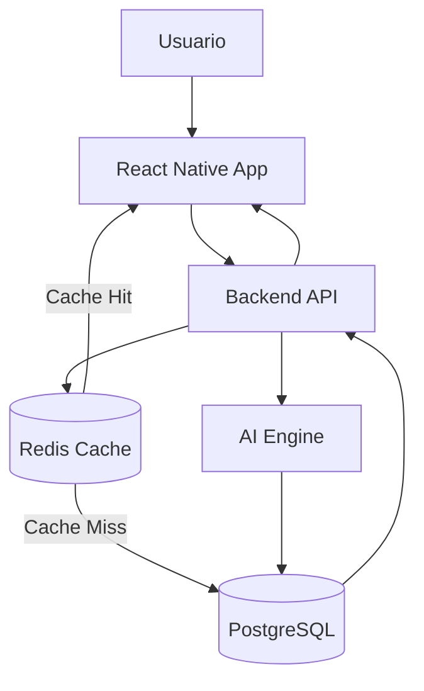

# MathMind AI

## Introducción

MathMind AI es una plataforma de aprendizaje adaptativo de cálculo mental orientada a estudiantes de diferentes niveles académicos.

La aplicación combina técnicas tradicionales de gamificación con Inteligencia Artificial para generar experiencias de entrenamiento personalizadas, ajustando la dificultad de los ejercicios según el rendimiento real de cada usuario.

El proyecto forma parte del Trabajo Fin de Máster en Desarrollo de Software Potenciado con IA.

---

# Objetivo de la aplicación

El objetivo principal es mejorar la capacidad de cálculo mental de los usuarios mediante ejercicios matemáticos adaptativos generados y gestionados por un sistema inteligente.

La plataforma debe ser capaz de:

- Evaluar continuamente el rendimiento del usuario.
- Ajustar automáticamente la dificultad de los ejercicios.
- Proporcionar retroalimentación inmediata.
- Ofrecer pistas contextuales cuando el usuario tenga dificultades.
- Mostrar explicaciones detalladas de la solución.
- Mantener la motivación mediante elementos de gamificación.

---

# Público objetivo

La aplicación está diseñada para diferentes perfiles educativos:

- Educación Primaria
- Educación Secundaria
- Bachillerato
- Ingeniería y carreras técnicas

Cada nivel dispone de conjuntos de ejercicios y estrategias de aprendizaje específicas.

---

# Funcionalidades Principales

## Modo Test

El usuario debe seleccionar una respuesta entre tres opciones posibles.

Características:

- Tiempo límite configurable.
- Corrección automática.
- Explicación de la respuesta.
- Registro de estadísticas.

---

## Modo Resolución

El usuario introduce manualmente el resultado.

Características:

- Entrada libre de respuestas.
- Temporizador configurable.
- Generación de pistas progresivas.
- Resolución guiada.

---

## Motor de Adaptación

La dificultad no depende exclusivamente del modelo de IA.

Se calcula utilizando métricas objetivas:

- Precisión histórica.
- Velocidad media de respuesta.
- Racha actual.
- Dificultad anterior.

Esto permite una experiencia consistente y económicamente sostenible.

---

## Sistema de Pistas

Cuando el usuario no resuelve un ejercicio dentro del tiempo establecido:

- No se muestra directamente la solución.
- Se presenta una pista orientativa.
- Se intenta reforzar el razonamiento matemático.

---

## Gamificación

La plataforma incluye:

- Puntuación global.
- Nivel del usuario.
- Historial de progreso.
- Estadísticas personales.
- Logros y retos futuros.

---

# Estrategia de Inteligencia Artificial

Uno de los objetivos del proyecto es demostrar una utilización eficiente de modelos generativos en un entorno real.

Por este motivo:

- La IA no participa en cada petición del usuario.
- Los ejercicios se generan previamente mediante procesos batch.
- Los resultados se almacenan en una base de datos.
- Redis actuará como caché para ejercicios frecuentes.
- La IA se utilizará principalmente para:
  - Generación masiva de ejercicios.
  - Generación de pistas.
  - Explicaciones paso a paso.
  - Creación de nuevo contenido cuando sea necesario.

Esta arquitectura reduce costes, mejora la latencia y aumenta la escalabilidad.

---

# Stack Tecnológico

## Frontend

- React Native
- Expo
- TypeScript
- Zustand
- TanStack Query

---

## Backend

- Node.js
- Express
- TypeScript

---

## Motor IA

- LangChain
- TypeScript
- Modelo Qwen

---

## Persistencia

- PostgreSQL
- Redis

---

## Calidad

- Vitest
- Playwright
- ESLint
- Prettier

---

## DevOps

- Docker
- Docker Compose
- GitHub Actions

---

# Arquitectura General

El proyecto sigue una arquitectura basada en monorepo.

```text
mathMindIA
│
├── apps
│   ├── mobile-app
│   ├── backend-api
│   └── ai-engine
│
├── packages
│   ├── shared-domain
│   ├── shared-types
│   ├── shared-utils
│   ├── shared-testing
│   ├── shared-config
│   └── shared-constants
│
├── docs
├── database
├── docker
└── scripts
```
# Flujo General de la Plataforma



---

# Metodología de Desarrollo

El proyecto se desarrollará siguiendo:

## Clean Architecture

Separación estricta entre:

- Domain
- Application
- Infrastructure
- Presentation

---

## TDD

Todo desarrollo comenzará mediante pruebas automatizadas.

Ciclo:

1. Red
2. Green
3. Refactor

---

## SDD

Las decisiones arquitectónicas preceden a la implementación.

Documentos clave:

- ADRs
- Diagramas
- Casos de uso
- Contratos

---

# Estado del Proyecto

Fase actual:

- Diseño del sistema.
- Definición de arquitectura.
- Definición del dominio.
- Preparación del monorepo.

---

# Autor

Rubén Abad

Trabajo Fin de Máster

Máster en Desarrollo de Software Potenciado con IA