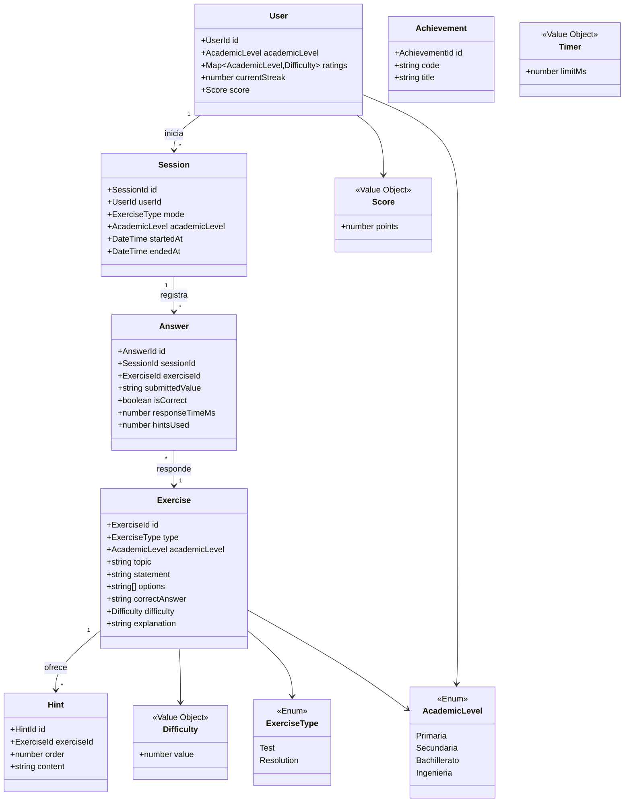

# ADR-004: Modelo de Dominio

## Estado

Propuesto

## Contexto

[STATUS.md](../STATUS.md) deja como pendiente prioritario #1 definir `DOMAIN.md`, con una lista inicial de entidades y value objects:

- Entidades: User, Exercise, ExercisePool, Session, Hint, Answer, Achievement.
- Value Objects: Difficulty, AcademicLevel, Score, Timer, ExerciseType.

Este ADR formaliza ese modelo, coherente con:

- [README.md](../../README.md): dos modos de juego (Test / Resolución) con reglas distintas de validación y pistas.
- [ARCHITECTURE.md](../../ARCHITECTURE.md): el dominio no debe depender de frameworks (Express, React, Prisma, etc.).
- [ADR-005](ADR-005-adaptive-difficulty-engine.md): ya fija cómo se representa y actualiza la dificultad (rating continuo tipo Elo).

## Decisión

### Value Objects

#### AcademicLevel

Enum cerrado: `Primaria | Secundaria | Bachillerato | Ingenieria`.

Determina la semilla de `Difficulty` de un usuario nuevo (ver ADR-005) y el particionado del Exercise Pool.

#### Difficulty

Envuelve el rating continuo definido en ADR-005 (`{ value: number }`), con invariante `value >= 0`.

> **Reconciliación con ADR-005**: ese ADR introdujo un tipo `Rating` con la misma forma y propósito. Para no duplicar el mismo concepto con dos nombres (viola la Regla de Reutilización de [ARCHITECTURE.md](../../ARCHITECTURE.md): "Prohibido duplicar... Entidades"), `Difficulty` pasa a ser el único Value Object canónico. Se actualiza ADR-005 para referenciar `Difficulty` en vez de `Rating`.

No incluye la etiqueta visible (Fácil/Media/Difícil); esa es una responsabilidad de presentación que mapea un rango de `value` a una etiqueta, no del dominio.

#### Score

Envuelve la puntuación de gamificación del usuario (`{ points: number }`, invariante `points >= 0`, solo incrementable). Es un concepto **distinto** de `Difficulty`: `Score` es progreso visible para el usuario, `Difficulty` es una señal interna del motor adaptativo. No deben confundirse ni fusionarse aunque ambos sean "un número que sube".

#### Timer

Envuelve el límite de tiempo configurable de un ejercicio (`{ limitMs: number }`, invariante `limitMs > 0`), con `isExceeded(elapsedMs: number): boolean`.

#### ExerciseType

Enum cerrado: `Test | Resolution`, mapeando directamente los dos modos del README. Determina:

- `Test`: respuesta de opción múltiple (3 opciones), sin sistema de pistas.
- `Resolution`: respuesta libre, con pistas progresivas (`Hint`) si se agota el tiempo.

### Entidades

#### User

| Campo | Tipo | Notas |
|---|---|---|
| `id` | UserId | |
| `email` | string | atributo de identidad del dominio, distinto de credenciales — necesario para US-001 (detección de email duplicado) |
| `academicLevel` | AcademicLevel | nivel actualmente seleccionado |
| `ratings` | Map\<AcademicLevel, Difficulty\> | un rating por nivel explorado, no solo el actual (ver ADR-005) |
| `currentStreak` | number | invariante `>= 0`; se resetea a 0 en cualquier fallo |
| `score` | Score | acumulado global de gamificación |
| `createdAt` | DateTime | |

Las credenciales (hash de contraseña, tokens) quedan fuera de este ADR (responsabilidad de `backend-api`, no del dominio de negocio de ejercicios) — el email sí forma parte del dominio porque identifica al usuario, no lo autentica.

> **Nota (contratos de repositorio)**: campo `email` añadido al materializar `UserRepository.findByEmail` como interfaz TypeScript real en `packages/shared-domain`.

#### Exercise

| Campo | Tipo | Notas |
|---|---|---|
| `id` | ExerciseId | |
| `type` | ExerciseType | |
| `academicLevel` | AcademicLevel | |
| `topic` | `TemaCode` | referencia al `code` del catálogo de temas definido en [ADR-006](ADR-006_math_topics.md) |
| `statement` | string | |
| `options` | string[3] \| undefined | solo si `type = Test` |
| `correctAnswer` | string | si `type = Test`, debe pertenecer a `options` |
| `difficulty` | Difficulty | equivalente a `exerciseRating` en ADR-005 |
| `explanation` | string | explicación paso a paso |
| `generatedBy` | `'ai-batch'` \| `'manual'` | procedencia, útil para trazabilidad de contenido generado por IA |

Invariante: `type = Test` ⇒ `options` tiene exactamente 3 elementos y `correctAnswer ∈ options`. `type = Resolution` ⇒ `options` es `undefined`.

#### Session

| Campo | Tipo | Notas |
|---|---|---|
| `id` | SessionId | |
| `userId` | UserId | |
| `mode` | ExerciseType | fija el modo para toda la sesión |
| `academicLevel` | AcademicLevel | |
| `startedAt` | DateTime | |
| `endedAt` | DateTime \| undefined | |

Invariante: todo `Answer` asociado a una `Session` referencia un `Exercise` cuyo `type` coincide con `Session.mode`.

#### Answer

| Campo | Tipo | Notas |
|---|---|---|
| `id` | AnswerId | |
| `sessionId` | SessionId | |
| `exerciseId` | ExerciseId | |
| `submittedValue` | string | |
| `isCorrect` | boolean | |
| `responseTimeMs` | number | |
| `hintsUsed` | number | solo relevante en `Resolution`; invariante `>= 0` |
| `createdAt` | DateTime | |

`Answer` es la forma persistida de un intento; `UpdateDifficultyUseCase` (ADR-005) deriva su `AttemptResult` transitorio (`correct`, `responseTimeMs`, `timeLimitMs`) a partir de un `Answer` recién creado más el `Timer` del `Exercise` respondido.

#### Hint

| Campo | Tipo | Notas |
|---|---|---|
| `id` | HintId | |
| `exerciseId` | ExerciseId | |
| `order` | number | progresivo: 1, 2, 3... |
| `content` | string | generado por IA ("Uso Permitido de IA: Generar pistas") |

Solo aplica a ejercicios `Resolution`.

#### Achievement

| Campo | Tipo | Notas |
|---|---|---|
| `id` | AchievementId | |
| `code` | string | clave única |
| `title` | string | |
| `description` | string | |

ADR-000 marca los logros como funcionalidad "(futuro)"; se define aquí solo el esqueleto mínimo para reservar el concepto en el dominio, sin diseñar criterios de desbloqueo todavía (evita sobre-diseñar algo fuera del alcance actual).

### Desviación respecto a ADR-000: ExercisePool no es una Entidad

ADR-000 lista `ExercisePool` como entidad. Se propone modelarlo en su lugar como **contrato de repositorio** (`ExerciseRepository.findByDifficultyBand(academicLevel, topic, band): Exercise[]`), no como una entidad con identidad y ciclo de vida propios.

Razón: un "pool" no es más que una vista filtrada de `Exercise` (mismo `academicLevel`, `topic`, y `difficulty` dentro de una banda). Modelarlo como entidad aparte obligaría a mantener sincronizado su estado con el `difficulty` de cada `Exercise`, duplicando la misma información en dos sitios — justo lo que prohíbe la Regla de Reutilización. Si en el futuro se necesita cachear el pool (p. ej. en Redis, ya previsto en la Cache Strategy), sigue siendo una vista derivada de `Exercise`, no una entidad de dominio nueva.

## Diagrama de clases

## Fuera de alcance

- Criterios de desbloqueo de `Achievement`.
- Modelo de autenticación/credenciales de `User`.
- Diseño físico de tablas/índices en PostgreSQL (responsabilidad de `backend-api`/infraestructura, no del dominio).

## Trazabilidad

Registrado en `.ai/prompts/architecture.md`.
