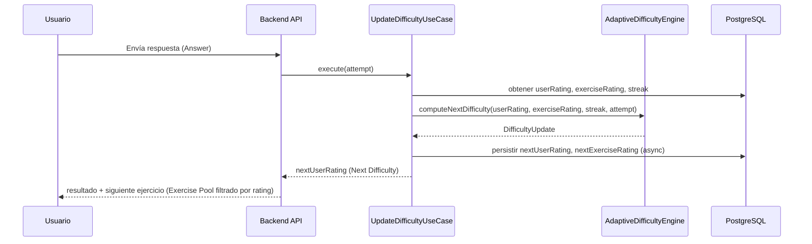

# ADR-005: Adaptive Difficulty Engine

## Estado

Aceptado — implementado y testeado (`packages/shared-domain/src/services/AdaptiveDifficultyEngine.ts`, 8/8 tests en verde). K provisional/cold start sigue diferido (ver nota en "Factor K").

## Contexto

MathMind AI necesita ajustar dinámicamente la dificultad de los ejercicios que recibe cada usuario, en función de su rendimiento real. Esta lógica es crítica para la experiencia del producto y, según [ARCHITECTURE.md](../../ARCHITECTURE.md) ("Estrategia IA"), está explícitamente prohibido delegarla en el modelo de IA:

> Uso NO recomendado: [...] Algoritmos de dificultad. Reglas determinísticas.

Por tanto, el motor de dificultad adaptativa (Adaptive Difficulty Engine, en adelante **ADE**) debe ser un servicio de dominio **determinista**, sin dependencias de LangChain/Qwen, ubicado en `shared-domain` y orquestado por `UpdateDifficultyUseCase` (ya listado en [STATUS.md](../STATUS.md) como UC-004).

Inputs ya fijados en [STATUS.md](../STATUS.md):

- Accuracy (¿acertó o no el ejercicio actual?)
- Response Time (tiempo empleado frente al límite configurado)
- Current Streak (racha de aciertos consecutivos)
- Previous Difficulty (dificultad del ejercicio que acaba de responder)

Output:

- Next Difficulty

## Decision Drivers

- No puede depender de IA (regla de arquitectura, no negociable).
- Debe ser una función pura, fácilmente testeable (TDD Enforcement Rule).
- Debe soportar una escala continua de dificultad (decisión tomada: ver Opciones Consideradas).
- Debe permitir que el Exercise Pool se autocalibre con el tiempo, ya que la dificultad inicial de un ejercicio generado por Qwen es solo una estimación.

## Opciones Consideradas

### Opción A — Rating tipo Elo (elegida)

Usuario y ejercicio tienen un *rating* en una escala continua. Tras cada intento se actualizan ambos ratings comparando el resultado esperado (según la diferencia de ratings) con el resultado real. Es el modelo usado por sistemas de ajedrez y adoptado por plataformas de aprendizaje adaptativo (p. ej. Duolingo).

- ✅ Literatura académica sólida y citable en la memoria del TFM.
- ✅ Autocalibración de la dificultad real de cada ejercicio a partir del uso agregado, sin intervención de IA.
- ✅ Función pura, determinista, trivial de testear unitariamente.
- ⚠️ Ruido en los primeros intentos de un usuario nuevo (cold start), mitigado con un *K* provisional más alto.

### Opción B — Fórmula ponderada (weighted score)

Combinar accuracy, tiempo, racha y dificultad previa en una fórmula de pesos fijos que produce directamente la siguiente dificultad.

- ✅ Muy simple de implementar y explicar.
- ❌ Pesos arbitrarios sin respaldo teórico salvo que se calibren con datos reales, de los que no se dispone al inicio del proyecto.
- ❌ No autocalibra la dificultad de los ejercicios; toda la estimación recae en lo que genere Qwen.

### Opción C — IRT / Bayesian Knowledge Tracing

Modelo probabilístico de teoría de respuesta al ítem, como en tests adaptativos tipo CAT.

- ✅ El más riguroso académicamente.
- ❌ Requiere calibración de parámetros por ítem (dificultad, discriminación) antes de poder usarse con fiabilidad — inviable con un pool de ejercicios recién generado y sin histórico.
- ❌ Complejidad de implementación desproporcionada para el alcance temporal de un TFM.

## Decisión

Se adopta la **Opción A: rating continuo tipo Elo**, con dos ratings independientes por entidad:

- `userRating` — habilidad del usuario, por `AcademicLevel`.
- `exerciseRating` — dificultad real del ejercicio (arranca con una estimación de Qwen en generación batch, y converge con el uso).

### Escala y semillas iniciales

Escala continua sin unidad predefinida (estilo Elo, no acotada a 0-100). Semillas propuestas por nivel académico — **valores placeholder, pendientes de calibrar** en fase de pruebas con usuarios reales; no se derivan de datos:

| AcademicLevel | Rating semilla |
|---|---|
| Primaria | 800 |
| Secundaria | 1200 |
| Bachillerato | 1600 |
| Ingeniería | 2000 |

Las bandas se solapan intencionadamente (sin techo/suelo duro entre niveles) para permitir que un usuario avanzado en un nivel derive de forma natural hacia dificultades del nivel superior, sin un mecanismo artificial de "subida de nivel". La promoción explícita de `AcademicLevel` queda fuera del alcance de este ADR.

### Fórmulas

**1. Resultado esperado** (probabilidad de acierto según diferencia de ratings):

```
E = 1 / (1 + 10^((exerciseRating - userRating) / 400))
```

**2. Resultado real (S)** — con crédito parcial por velocidad, manteniendo siempre S(acierto) > S(fallo):

```
S = 0                                                    si falla
S = 0.5 + 0.5 * clamp((timeLimit - responseTime) / timeLimit, 0, 1)   si acierta
```

Un acierto instantáneo tiende a S≈1.0; un acierto justo en el límite de tiempo da S=0.5; cualquier fallo es siempre S=0, sin excepción.

**3. Factor K (sensibilidad del ajuste)**, modulado por racha:

```
K = K_base * (1 + min(streak, 5) * 0.1)
```

- `K_base = 32` (valor estándar no-provisional en sistemas Elo).
- `K_base = 48` durante los primeros `N_PROVISIONAL = 10` ejercicios de un usuario en un nivel (convergencia más rápida, cold start).
- Una racha de 5+ aciertos multiplica K hasta ×1.5, reconociendo el dominio más rápido; un fallo resetea `streak` a 0 y K vuelve al valor base, evitando sobrecorrección tras un único error.

> **Hueco de diseño detectado al escribir los tests** (`packages/shared-domain/src/services/AdaptiveDifficultyEngine.test.ts`): el K provisional necesita saber cuántos ejercicios lleva ya el usuario en ese nivel, pero ni la interfaz `computeNextDifficulty` ni `User` ([ADR-004](ADR-004_domain.md), `ratings: Map<AcademicLevel, Difficulty>`) modelan ese contador en ningún sitio. **Diferido explícitamente** (mismo criterio que `Achievement` o la librería de navegación de `mobile-app`): los tests y la futura implementación cubren el algoritmo con `K_base = 32` fijo. Antes de implementar el cold start hace falta decidir dónde vive el contador (¿campo nuevo en `User`? ¿derivado contando `Answer`?).

**4. Actualización del rating de usuario**:

```
nextUserRating = userRating + K * (S - E)
```

**5. Actualización del rating del ejercicio** (simétrica, con constante menor porque un ejercicio es respondido por muchos usuarios y debe moverse despacio):

```
nextExerciseRating = exerciseRating - K_exercise * (S - E)
K_exercise = 8
```

Esta actualización puede aplicarse de forma asíncrona/batch (no bloqueante en el request path), coherente con el principio de "la IA no participa en cada petición" — aquí aplicado también a la escritura del rating del ejercicio.

**Output (Next Difficulty)** = `nextUserRating`. El caso de uso de selección de ejercicio (UC-001) consulta el Exercise Pool filtrando por `exerciseRating` dentro de una banda de tolerancia alrededor de `nextUserRating` (propuesto: ±150) y por tema/`AcademicLevel` solicitados.

### Interfaces (diseño, sin implementación)

`Difficulty` es el Value Object definido en [ADR-004](ADR-004_domain.md), no un tipo nuevo local a este ADR.

```typescript
interface AttemptResult {
  readonly correct: boolean
  readonly responseTimeMs: number
  readonly timeLimitMs: number
}

interface DifficultyUpdate {
  readonly nextUserRating: Difficulty
  readonly nextExerciseRating: Difficulty
}

interface AdaptiveDifficultyEngine {
  computeNextDifficulty(
    userRating: Difficulty,
    exerciseRating: Difficulty,
    currentStreak: number,
    attempt: AttemptResult,
  ): DifficultyUpdate
}
```

`AdaptiveDifficultyEngine` vive en `packages/shared-domain` como Domain Service puro (sin I/O). `UpdateDifficultyUseCase` en `backend-api` lo invoca, persiste el resultado y dispara la actualización (potencialmente diferida) del `exerciseRating`.

### Diagrama de secuencia



## Consecuencias

### Positivas

- Cumple estrictamente la regla de "sin IA en algoritmos de dificultad".
- El Exercise Pool se autocalibra con el uso real, reduciendo la dependencia de que Qwen estime bien la dificultad al generar.
- Función pura y determinista: se puede testear exhaustivamente con TDD sin mocks de infraestructura.
- Base teórica citable (Elo, aplicaciones en e-learning tipo Duolingo) — refuerza la memoria del TFM.
- Escala continua evita saltos de dificultad visibles y bruscos para el usuario.

### Negativas / Riesgos

- Cold start: los primeros intentos de un usuario nuevo son ruidosos; mitigado parcialmente con K provisional, pero es una limitación conocida de los sistemas Elo.
- Las semillas por nivel académico son estimaciones sin validar; requieren ajuste tras pruebas con usuarios reales (pendiente, fuera de alcance de este ADR).
- Un único `userRating` por `AcademicLevel` no distingue habilidad por tema (p. ej. fuerte en sumas, débil en fracciones) — la señal se promedia. Se deja abierto como posible ADR futuro (rating por tema) si se detecta necesidad real.
- Actualización concurrente de `exerciseRating` por múltiples usuarios simultáneos requiere una estrategia de escritura (cola/batch) para evitar contención; se resuelve en el diseño de infraestructura de `backend-api`, no en este ADR.

## Fuera de alcance (follow-ups)

- Rating por tema/subtema en lugar de por `AcademicLevel` global.
- Decaimiento del rating por inactividad prolongada.
- Mecanismo explícito de promoción entre `AcademicLevel`.
- Calibración empírica de semillas y constantes (`K_base`, `K_exercise`, ancho de banda de selección) con datos de uso real.
- K provisional / cold start (`K_base = 48` primeros 10 ejercicios) — requiere un contador de intentos por nivel no modelado todavía en `User`; ver nota en "Factor K" arriba. Los tests y la implementación actuales usan `K_base = 32` fijo.

## Trazabilidad

Registrado en `.ai/prompts/architecture.md`.
